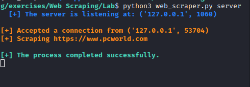
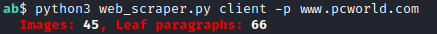
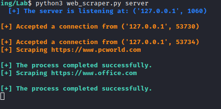
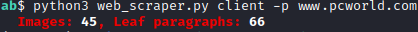
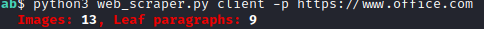

# TCP Web Scraper

This is a client-server based console application which enables client to send URL to the server. In return, the server scrapes the webpage using BeautifulSoup to find number of images and leaf paragraphs.

## Installation

Clone the repository using following command
```bash
git clone https://github.com/Shakar-Gadirli/Web_Scraper_TCP.git
```
Install requirements for this application.
```bash
pip3 install -r requirements.txt
```

## Usage

For server and client, open 2 terminal tabs. In the first tab, run the following command to create server.

**Server terminal**
```bash
python3 web_scraper.py server
```
**Client terminal**
```bash
python3 web_scraper.py client -p [URL]
```
**Example**




**Threading Example**
Additionally, this app uses threading to serve several clients simultaneously. That means, while the server processes one client's request, it can accept connections and process other clients' requests. 





